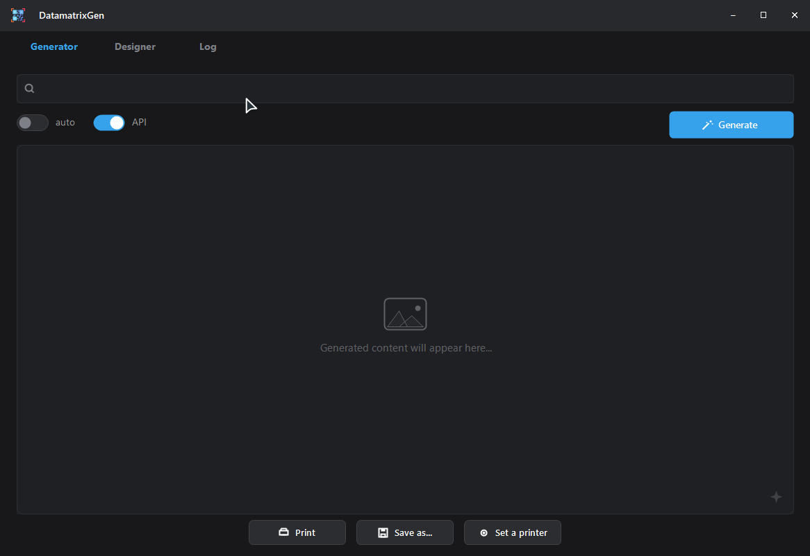
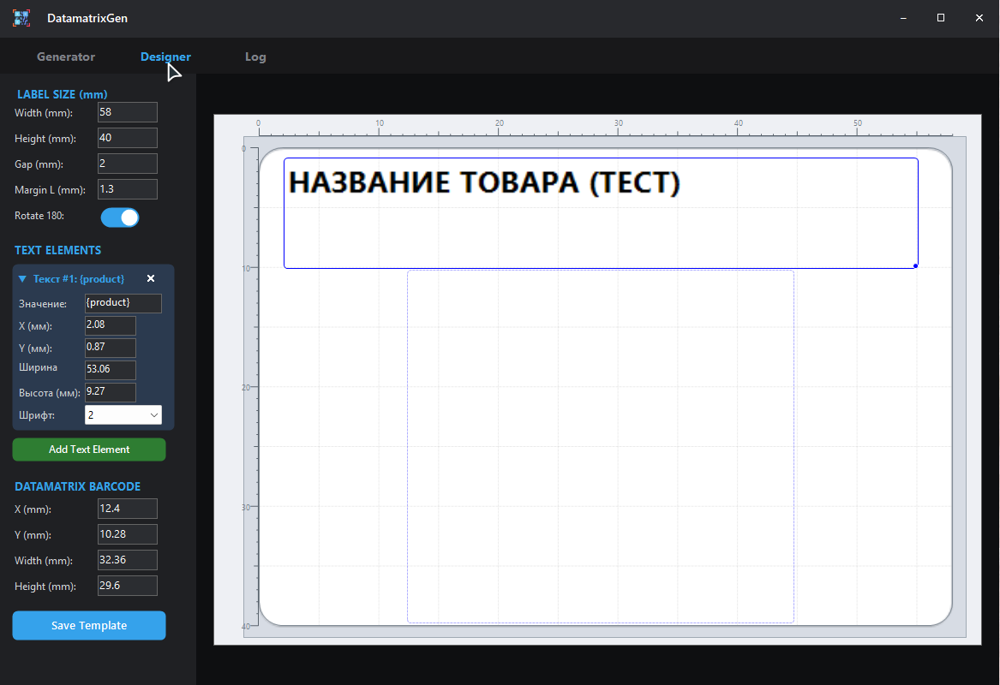

# DataMatrix Generator

Портативная программа для дублирования, генерации, и печати этикеток системы маркировки «Честный знак» (Chestny Znak).

## Возможности

- ✅ Генерация GS1 DataMatrix из сканированного кода
- ✅ Предпросмотр сгенерированной этикетки
- ✅ Печать через системный диалог Windows
- ✅ Экспорт в PNG
- ✅ Авто-режим (скан → генерация → печать в один клик)
- ✅ Логирование с поиском по коду
- ✅ Поддержка 3 форматов ввода: со скобками `(01)`, raw GS1, с GS-разделителями
- ✅ Тёмная тема, кастомный заголовок, ресайз окна
- ✅ Не требует установки — работает на Windows 7–11

## Скриншоты




## Технологии

- **Язык:** C# (Windows Forms)
- **Компиляция:** `csc.exe` (встроен в .NET Framework)
- **Библиотеки:** ZXing.Net (генерация DataMatrix)

## Сборка

```bash
csc -win32icon:"app.ico" ^
    -resource:"app.png,DataMatrixGen.app.png" ^
    -reference:"zxing.dll" ^
    -reference:System.Windows.Forms.dll ^
    -reference:System.Drawing.dll ^
    -reference:System.dll ^
    -target:winexe ^
    -out:"DataMatrixGen.exe" ^
    "app.cs"
```

## Структура кода GS1 DataMatrix

```
<FNC1>01<GTIN>21<Серийный номер><GS>91<Ключ проверки><GS>92<Крипто-подпись>
```

| Часть | Описание |
|-------|----------|
| `FNC1` | Маркер GS1 (добавляется автоматически) |
| `01` + GTIN (14 цифр) | Глобальный номер товара |
| `21` + серийный номер | Идентификатор экземпляра |
| `GS` (ASCII 29) | Разделитель между КИ и крипто-хвостом |
| `91` + ключ проверки | Ключ (4 символа) |
| `GS` (ASCII 29) | Разделитель между ключом и подписью |
| `92` + крипто-подпись | Криптографическая подпись (88 символов) |

## Форматы ввода

| Формат | Пример |
|--------|--------|
| Со скобками | `(01)0465...(21)5ZGN...(91)EE12(92)1cdP+...` |
| Без скобок | `010465...215ZGN...91EE12...92...` |
| С GS-разделителями | `010465...\u001D91EE12\u001D92...` |

## Лицензия

Свободное использование. ZXing.Net — Apache License 2.0.
